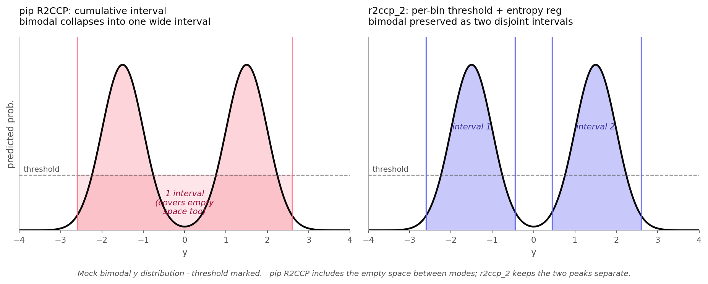

# ensemble-bid-prediction

[English](./README.md) | 한국어

PQ 입찰 사정율 예측. R2CCP 분포 예측 + Monte Carlo 입찰률 최적화.

[](LICENSE)
[](https://www.python.org/downloads/)

## What it does

공공조달 PQ 입찰에서 최적 `normalized_bid_rate` 예측. 낙찰가를 point prediction이 아니라 분포 문제로 본다.

## Why

PQ 입찰은 구조적으로 불평등. 기술점수가 회사별 `min_bid_rate`를 결정하므로 점수가 높을수록 입찰 자유도가 넓다. "낙찰가"를 단일 숫자로 예측하면 이 비대칭성과 경쟁사 입찰의 multi-modal 형태를 둘 다 놓침.

## Approach

### R2CCP custom impl (`r2ccp_2.py`)

pip R2CCP는 APS cumulative-mass interval을 쓰는데, bimodal 분포 두 봉우리를 한 덩어리로 뭉개버린다 (interval collapse). **per-bin threshold**로 전환해서 분포 형태 그대로 보존.



*pip R2CCP는 두 봉우리와 그 사이 빈 공간까지 하나의 interval로 합쳐버림. r2ccp_2는 두 봉우리를 disjoint interval로 그대로 유지.*

| | pip R2CCP | this impl |
|---|---|---|
| Interval | APS cumulative | Per-bin threshold |
| Bimodal preserved | no | yes |
| entropy_weight | fixed | configurable (default 3.0) |
| loss_weight | 1.0 | winner 5x |
| Adaptive range | min/max | percentile 0.5/99.5 |

### 8 context models (Q x BRD)

Q-group: ranking quantile (Q1 head-of-pack vs Q2 tail). BRD-group: bid-rate-difference quartile.

```
              BRD_1  BRD_2  BRD_3  BRD_4
       Q1     m1     m2     m3     m4
       Q2     m5     m6     m7     m8
```

Context별 conformal alpha (`group_alphas`)를 90-95% coverage로 튜닝.

### Monte Carlo simulation (500K iterations)

`[0.975, 1.025]` 구간을 `0.0005` step으로 훑는다. 후보 입찰률 `r`마다:

1. `yega`를 `Normal(institution_mean, institution_std)`에서 샘플
2. 경쟁사 입찰률을 tiered model (dedicated / behavioral / global)로 샘플
3. 승수 카운트

대수의 법칙으로 `P(win | r)` 추정. `tol_validity` 전략은 max `P(win)` 대비 `tolerance=0.02` 안에서 validity 최대인 입찰률 선택.

## Results (aggregate)

- Context별 lift: argmax / tol_validity 전략 (context별 +1.2 ~ +6.0%p)
- Coverage: out-of-time 입찰 기준 90% CI 안에 평균 84.2%
- Backtest 평균 낙찰률: 약 +2.0%p (회사별 편차 있음)

## Repository layout

```
ensemble-bid-prediction/
├── r2ccp_2.py                       # core R2CCP custom impl (per-bin threshold)
├── mc_cp_simulation.py              # MC simulation engine
├── mc_cp_optimization.py            # Grid-search optimizer
├── mc_cp_optimization_fast.py       # Reduced-iter variant for testing
├── mc_validation_full.py            # Full validation (50K iter)
├── mc_simulator_production.py       # Production-grade simulator
├── feature_engineering.py           # Position / gap / notice / project / institution features
├── evaluate.py                      # Evaluation suite
├── backtest_simulation.py           # Backtest
├── backtest_simulation_tolerance.py # Backtest with tolerance strategy
├── strategic_bidding_optimizer.py   # Strategy comparison
├── copula_test.py / rank_copula_test.py  # Independence test for competitor sampling
├── train_cluster_models.py          # Per-cluster R2CCP models
├── train_company_models.py          # Per-company R2CCP models
├── train_strategic_mimicry.py       # Strategic mimicry training
├── train_weighted_quantile.py       # Weighted quantile regression
├── validate_inference.py / validate_optimizer.py / validation_backtest*.py
├── verify_normalized_formula.py     # Sanity check on normalization
├── analyze_expr_params.py           # Hyperparameter analysis
├── test_*.py                        # Unit tests
└── src/
    ├── data_pipeline/               # Metric calculators (min_bid_rate, normal_bid_line, ...)
    ├── features/                    # Feature engineering pipeline
    ├── models/conformal.py          # R2CCP wrapper
    └── preprocessing/               # Filters, recalculations, validators
```

## Quick Start

```bash
pip install -r requirements.txt

# Train per-context models (requires features + processed data, not included)
python train_cluster_models.py
python train_company_models.py

# Run validation with full MC simulation
python mc_validation_full.py

# Backtest with tolerance strategy
python backtest_simulation_tolerance.py
```

## Repository note

방법론, R2CCP custom impl, MC simulation engine, context별 학습 파이프라인 공개. 학습 데이터, fitted model artifact, 회사별 backtest 테이블은 의도적으로 제외.

## References

- Guha et al. 2024, *R2CCP: Regression-as-Classification with Conformal Coverage Prediction*: https://arxiv.org/abs/2404.08168

## License

MIT
